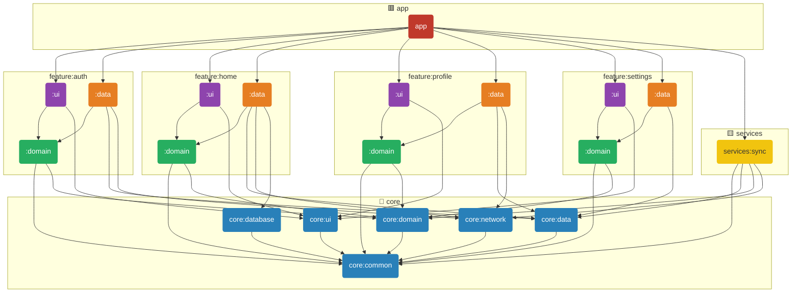

# Android Architecture Template

A production-ready Android project template built with **MVI + Clean Architecture + Fine-Grained Multi-Module** design. Every feature is split into three independent Gradle modules (`domain`, `data`, `ui`), enforcing strict layer boundaries at the build level — not just by convention.

---

## Module Structure

```
app/
├── core/
│   ├── common/        # Result<T>, coroutine dispatchers, extensions
│   ├── data/          # BaseRepository, AppPreferences, LogoutService, Syncable
│   ├── database/      # Room database, DAOs, entities
│   ├── domain/        # UseCase / FlowUseCase / NoParamUseCase base classes
│   ├── network/       # Retrofit, OkHttp interceptors, ApiResponse
│   └── ui/            # MviViewModel base, Compose components, theme
│
├── feature/
│   ├── auth/
│   │   ├── domain/    # Models (User, AuthCredentials), AuthRepository interface, use cases
│   │   ├── data/      # AuthRepositoryImpl, AuthApi, data sources, AuthDataModule
│   │   └── ui/        # LoginScreen, RegisterScreen, ViewModels, Contracts
│   │
│   ├── home/
│   │   ├── domain/    # Post model, HomeRepository interface, GetPostsUseCase, RefreshPostsUseCase
│   │   ├── data/      # HomeRepositoryImpl, HomeApi, PostMapper, HomeDataModule
│   │   └── ui/        # HomeScreen, HomeViewModel, HomeContract, PostItem
│   │
│   ├── profile/
│   │   ├── domain/    # Profile model, ProfileRepository interface, use cases
│   │   ├── data/      # ProfileRepositoryImpl, ProfileApi, ProfileDataModule
│   │   └── ui/        # ProfileScreen, ProfileViewModel, ProfileContract
│   │
│   └── settings/
│       ├── domain/    # AppSettings model, ThemeMode, SettingsRepository interface
│       ├── data/      # SettingsRepositoryImpl, SettingsDataModule
│       └── ui/        # SettingsScreen, SettingsViewModel, SettingsContract
│
└── services/
    └── sync/          # WorkManager background sync (depends on core:data:Syncable only)
```

---

## Module Dependency Graph



**Colour key:** 🔴 app &nbsp;|&nbsp; 🟣 feature:ui &nbsp;|&nbsp; 🟠 feature:data &nbsp;|&nbsp; 🟢 feature:domain &nbsp;|&nbsp; 🔵 core &nbsp;|&nbsp; 🟡 services

---

## Dependency Rules (enforced at build level)

```
feature:X:domain  ←  core:common, core:domain
feature:X:data    ←  feature:X:domain, core:common, core:data, core:network
feature:X:ui      ←  feature:X:domain, core:common, core:ui          ← NO data dependency
app               ←  feature:X:ui + feature:X:data  (the only place they meet)
```

The `ui` module **cannot** import from `data` — the Gradle dependency graph makes this a **compile error**, not a lint warning.

---

## Why Fine-Grained Feature Modules?

### 1. Strict layer isolation — enforced by the build system
In a single-module feature, nothing stops a ViewModel from accidentally importing a DAO or a Retrofit service. With three separate modules, the compiler enforces the rule: `ui` has no path to `data` in its dependency graph. Violations fail the build.

### 2. Selective dependency — consume only what you need
Another module or app that wants to reuse business logic can depend on `:feature:home:domain` alone — it gets the use cases and interfaces without pulling in Room, Retrofit, Moshi, or any implementation detail. Gradle only compiles what is actually needed.

### 3. Faster incremental builds
Gradle's incremental build only recompiles modules whose inputs changed. Changing a screen layout touches only `:feature:home:ui` — domain and data are untouched and their cached outputs are reused. In a monolithic feature module every UI change would trigger a full recompile of data and domain too.

### 4. Smaller binary footprint per consumer
An SDK or library consumer that embeds only the domain layer avoids the transitive weight of Retrofit, Room, and Moshi. Each layer adds its own dependencies only where they are actually needed.

### 5. Parallel compilation
Gradle compiles independent modules in parallel. `domain`, `data`, and `ui` of different features have no cross-feature dependencies, so the entire feature graph can be compiled concurrently.

### 6. Clearer ownership and testability
Unit tests for use cases live in `domain` with zero Android framework dependencies — just pure Kotlin. Integration tests for the repository live in `data`. UI tests live in `ui`. Each test suite has a minimal compile scope and runs faster.

### 7. Future-proof reuse
If `feature:home` later needs to be published as a standalone SDK, the split is already done. Consumers can take `:feature:home:domain` (interface contract), `:feature:home:data` (network + cache implementation), or both — independently versioned if needed.

---

## How the App Wires It Together

`app` is the only module that depends on **both** `ui` and `data` for each feature. This is intentional: it is the composition root where Hilt's dependency graph is assembled.

```
app ──► feature:home:ui   (screens, ViewModels)
    └──► feature:home:data  (Hilt bindings: HomeRepositoryImpl → HomeRepository)
```

`feature:home:ui` injects `HomeRepository` (the interface from `domain`). `feature:home:data`'s `HomeDataModule` provides the concrete binding. Neither module knows about the other — `app` is the glue.

---

## MVI Pattern

Every feature follows the same three-part contract:

```kotlin
data class HomeState(
    val posts: List<Post> = emptyList(),
    val isLoading: Boolean = false,
    val error: String? = null,
) : UiState

sealed interface HomeIntent : UiIntent {
    data object LoadPosts    : HomeIntent
    data object RefreshPosts : HomeIntent
}

sealed interface HomeEffect : UiEffect {
    data object NavigateToProfile                    : HomeEffect
    data class ShowSnackbar(val message: String)     : HomeEffect
}
```

ViewModels extend `MviViewModel<State, Intent, Effect>` and only mutate state via `setState { }`.

---

## Tech Stack

| Area | Library |
|------|---------|
| UI | Jetpack Compose + Material 3 |
| Architecture | MVI + Clean Architecture |
| DI | Hilt |
| Navigation | Navigation Compose |
| Networking | Retrofit + OkHttp + Moshi |
| Local storage | Room + DataStore |
| Async | Kotlin Coroutines + Flow |
| Image loading | Coil |
| Background work | WorkManager |
| Testing | JUnit4, MockK, Turbine, Truth, Robolectric |

---

## Use Case Base Classes

| Class | Use when |
|-------|----------|
| `UseCase<P, R>` | Single suspend call with a parameter |
| `NoParamUseCase<R>` | Single suspend call with no parameter |
| `FlowUseCase<P, R>` | Ongoing stream; emits `Flow<Result<R>>` |

---

## Getting Started

1. Clone the repo
2. Open in Android Studio Hedgehog or newer
3. Replace `com.example.arch` with your package name across all files and `build.gradle.kts` namespaces
4. Update `AppConstants` with your API base URL
5. Run on device or emulator

---

## License

```
Copyright 2024 karishmaagr

Licensed under the Apache License, Version 2.0 (the "License");
you may not use this file except in compliance with the License.
You may obtain a copy of the License at

    http://www.apache.org/licenses/LICENSE-2.0
```
